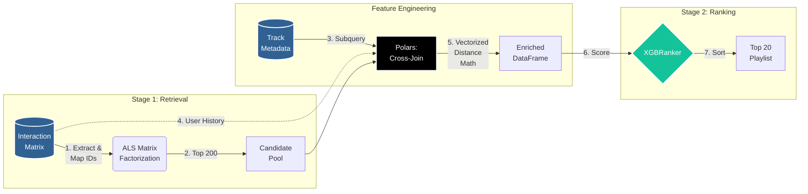

# Two-Stage "Discover Weekly" Playlist Engine


This project simulates how Spotify might build "Discover Weekly" end-to-end: give it a playlist, and it hands back
twenty tracks the listener probably hasn't heard yet but would likely enjoy. It's trained on the Spotify Million
Playlist Dataset, roughly 66 million listening interactions across 2 million tracks.

Rather than pushing that much data through a single monolithic model (or a Pandas DataFrame that would fall over
trying), the project splits the problem into a **Two-Stage Funnel**: a fast retrieval pass that narrows millions
of candidates down to a couple hundred, followed by a more expensive ranking pass that sorts those down to the
final twenty. **PostgreSQL** handles the heavy, out-of-core data transformations, **Polars** does the vectorized
feature engineering, and **XGBoost (Learning-to-Rank)** handles the final sort.

## Dataset Overview

The pipeline is built to handle real production-scale data rather than a toy sample, so it orchestrates over two
sizeable tables from the start:

### 1. Interaction Matrix (`interaction_matrix`)
From the Spotify Million Playlist Dataset. Each row is an implicit co-occurrence signal — a track that showed up
in a given playlist — which stands in for a user's listening history.
* **Data Scale:** ~66,000,000 interaction rows

| Column Name   | Data Type | Description                                                  |
|:--------------|:----------|:-------------------------------------------------------------|
| `playlist_id` | `TEXT`    | Anonymized unique string identifier for the Spotify playlist |
| `track_id`    | `TEXT`    | Unique Spotify Base62 alphanumeric string track URI          |

### 2. Unified Track Metadata (`track_metadata`)
Holds the acoustic properties (danceability, tempo, energy, and so on) that the ranking stage uses to
score how well a candidate track fits a listener's taste.
* **Data Scale:** ~2,000,000 unique tracks

| Column Name      | Data Type  | Constraints   | Description                                                    |
|:-----------------|:-----------|:--------------|:---------------------------------------------------------------|
| `track_id`       | `TEXT`     | `PRIMARY KEY` | Unique Spotify Base62 track alphanumeric URI                   |
| `artist_name`    | `TEXT`     |               | Name of the primary performing artist                          |
| `track_name`     | `TEXT`     |               | Name of the track song title                                   |
| `danceability`   | `REAL`     |               | Measure of how suitable the track is for dancing (0.0 to 1.0)  |
| `tempo`          | `REAL`     |               | Estimated overall tempo of the track in beats per minute (BPM) |
| `energy`         | `REAL`     |               | Perceptual measure of intensity and activity (0.0 to 1.0)      |
| `acousticness`   | `REAL`     |               | Confidence the track is acoustic (0.0 to 1.0)                  |
| `loudness`       | `REAL`     |               | Overall loudness of a track in decibels (dB)                   |
| `valence`        | `REAL`     |               | Measure of musical positiveness conveyed (0.0 to 1.0)          |


### 3. The Mapping Layer (`interaction_matrix_mapped`)
Spotify's playlist and track IDs are long, opaque strings, which are expensive to work with at matrix-math scale.
This table, built with a server-side `DENSE_RANK()` window function, remaps them to contiguous 32-bit integers
(`playlist_int_id` and `track_int_id`) so the `implicit` library can hold the sparse interaction grid in memory
efficiently.

## System Architecture

Turning 66 million interactions and 2 million tracks into a 20-song playlist happens in two passes:

1. **Stage 1: Candidate Generation**
   User and track IDs are remapped to integers directly in PostgreSQL, so Python never has to hold the full string
   ID space in memory. An **Alternating Least Squares (ALS)** matrix factorization model (via the `implicit`
   library) then trains on the sparse user-item grid and, given a playlist, narrows the full ~2.2 million-song
   catalog down to a personalized shortlist of **200 candidate tracks** in milliseconds.

2. **Stage 2: Scoring & Ranking**
   Each of those 200 candidates gets its audio features attached, plus a vectorized measure of how closely it
   matches the listener's taste profile. An **XGBRanker** model then scores and sorts them, trained to optimize
   **NDCG (Normalized Discounted Cumulative Gain)** — a metric that specifically penalizes getting the top of the
   list wrong, since that's what a listener actually sees first. The result is the final Top 20.



## Key Engineering Decisions

* **Out-of-Core Memory Management:** Aggregations like `DENSE_RANK()`, `AVG()`, and `COUNT()` run inside
PostgreSQL rather than in Python, which keeps the Python process's memory footprint under 2GB even though the
underlying tables are far larger than that.
* **Idempotent Infrastructure:** Nothing here depends on manual SQL console work. The ingestion script
(`src/ingestion.py`) tears down and rebuilds the database from scratch, so the whole pipeline can be re-run
end-to-end at any time and land in the same state.
* **Shift-Left Data Quality:** Rather than hitting a real-time audio-features API (with its rate limits) at
inference time, acoustic features were merged in once, upfront, via a one-time ETL migration from an open-source
SQLite archive into the metadata table.
* **Model Serialization:** Training and inference are decoupled. The offline training scripts save their learned
weights to disk — ALS embeddings to `als_model.npz`, the ranker's trees to `xgb_ranker.json` — so the lightweight
inference path never has to pay the cost of retraining.

## Evaluation

Evaluation lives in its own [`eval/`](eval/) directory, separate from the `src/` pipeline code it measures — these
scripts import from `src` but aren't part of the serving path themselves. Both use a held-out split of each
playlist's tracks as a proxy for "would the listener have liked this recommendation":

* **[`eval/evaluate.py`](eval/evaluate.py)** runs an offline comparison of three systems — the full engine (ALS +
XGBRanker), an ALS-only ablation (retrieval with no reranking), and a popularity baseline (just the most
globally-interacted-with tracks). Comparing the full engine against ALS-only is the most telling number here: it
answers whether the ranking stage is earning its keep or just adding complexity on top of what retrieval already
gets right. Reports Recall@K and NDCG@K for each arm, with a paired t-test against the baselines.

  ```bash
  python eval/evaluate.py --n-playlists 2000 --holdout-frac 0.2 --k 20
  ```

* **[`eval/ab_test_sim.py`](eval/ab_test_sim.py)** is the live-experiment counterpart to `evaluate.py`. Where
`evaluate.py` scores every playlist under every arm and uses paired tests (a within-subjects offline comparison),
this script simulates what a real A/B test can actually do: it assigns each playlist to **exactly one** arm — a
between-subjects, one-arm-per-playlist split — and compares arms with independent-sample tests (Welch's t-test for
the continuous metrics, a two-proportion z-test for the binary hit rate). It runs a small pilot first (scored under
all arms) to estimate each arm's rate and variance, prints a power analysis (minimum detectable effect at the
planned sample size, and the per-arm sample size actually required to hit a target lift) before touching the full
data, and sizes the full run to ~3× the required per-arm n. A side benefit of the one-arm-per-playlist design: only
~1/3 of playlists run the expensive full-engine pipeline, so it's substantially cheaper than scoring every arm on
every playlist.

  ```bash
  python eval/ab_test_sim.py --n-playlists 3000 --k 20 --pilot-n 200
  ```

## Running the Pipeline

### 1. Download the Datasets
Create a `data/` directory in your project root and download the following prerequisites:
* **Interaction Matrix:** Download the [Spotify Million Playlist Dataset on Kaggle](https://www.kaggle.com/datasets/himanshuwagh/spotify-million?resource=download) and place the raw slices in `data/raw/spotify_mpd/`.
* **Unified Audio Features:** Download the [2 Million Songs Audio Features Dataset](https://www.kaggle.com/datasets/krishsharma0413/2-million-songs-from-mpd-with-audio-features) and save it as `data/raw/extracted.sqlite`.

### 2. Environment Setup
Make sure you have a PostgreSQL server running locally (port 5432), then install the drivers and modeling libraries:
```bash
pip install polars psycopg connectorx implicit xgboost scipy numpy
```

### 3. Build the Database Foundation

Run the ingestion script. It drops any old tables, rebuilds `track_metadata` and `interaction_matrix` from the
raw files, and generates the integer ID mappings the sparse math needs:

```bash
python src/ingestion.py
```

### 4. Train the Engines

Train the Stage 1 retriever and the Stage 2 ranker. Each script builds its own matrices, trains, and writes its
learned weights to disk (`als_model.npz` and `xgb_ranker.json`):

```bash
python src/train_als.py
python src/train_ranking.py
```

### 5. Run Inference (Discover Weekly)

Generate a playlist. This mocks a request for a given user, loads the trained artifacts into memory, runs them
through the full retrieval-then-ranking funnel, and prints the resulting Top 20 tracks:

```bash
python src/recommend.py
```

### 6. Evaluate the Engine

Once you have trained models, check whether they're actually earning their complexity — see the
[Evaluation](#evaluation) section above for what each script measures:

```bash
python eval/evaluate.py --n-playlists 2000 --holdout-frac 0.2 --k 20
python eval/ab_test_sim.py --n-playlists 3000 --k 20 --pilot-n 200
```

