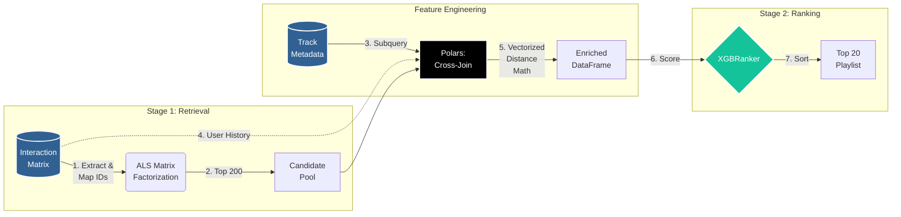

# Two-Stage "Discover Weekly" Playlist Engine


A machine learning pipeline that simulates Spotify's music recommendation system end-to-end, trained on the Spotify Million 
Playlist Dataset. When given a playlist, generates a twenty-track "Discover Weekly"-style playlist of recommended songs. 

Instead of forcing millions of rows through a Pandas DataFrame or a single monolithic model, this project 
implements a **Two-Stage Funnel Architecture** (Retrieval & Ranking). It leverages **PostgreSQL** for 
out-of-core data transformations, **Polars** for vectorized feature engineering, and **XGBoost (Learning-to-Rank)** for 
precision sorting.

## Dataset Overview

This engine is built entirely to handle large-scale, sparse, and high-dimensional analytical workloads. Rather than prototyping on small sample data, the pipeline orchestrates over two massive production-grade tables:

### 1. Interaction Matrix (`interaction_matrix`)
From the Spotify Million Playlist Dataset. Tracks the implicit co-occurrence signals representing user listening histories.
* **Data Scale:** ~66,000,000 interaction rows

| Column Name   | Data Type | Description                                                  |
|:--------------|:----------|:-------------------------------------------------------------|
| `playlist_id` | `TEXT`    | Anonymized unique string identifier for the Spotify playlist |
| `track_id`    | `TEXT`    | Unique Spotify Base62 alphanumeric string track URI          |

### 2. Unified Track Metadata (`track_metadata`)
Stores the explicit content-based acoustic properties used for feature alignment during ranking.
* **Data Scale:** ~2,000,000 unique track tracks

| Column Name      | Data Type  | Constraints   | Description                                                    |
|:-----------------|:-----------|:--------------|:---------------------------------------------------------------|
| `track_id`       | `TEXT`     | `PRIMARY KEY` | Unique Spotify Base62 track alphanumeric URI                   |
| `artist_name`    | `TEXT`     |               | Name of the primary performing artist                          |
| `track_name`     | `TEXT`     |               | Name of the track song title                                   |
| `danceability`   | `REAL`     |               | Measure of how suitable the track is for dancing (0.0 to 1.0)  |
| `tempo`          | `REAL`     |               | Estimated overall tempo of the track in beats per minute (BPM) |
| `energy`         | `REAL`     |               | Perceptual measure of intensity and activity (0.0 to 1.0)      |
| `acousticness`   | `REAL`     |               | Confidence the track is acoustic (0.0 to 1.0)                  |
| `loudness`       | `REAL`     |               | Overall loudness of a track in decibels (dB)                   |
| `valence`        | `REAL`     |               | Measure of musical positiveness conveyed (0.0 to 1.0)          |


### 3. The Mapping Layer (`interaction_matrix_mapped`)
An intermediary, database-managed table dynamically generated using a server-side window function (`DENSE_RANK()`). This
compacts raw string IDs into contiguous 32-bit integers (`playlist_int_id` and `track_int_id`), compressing 
the sparse matrix grid to maximize C++ memory address speeds inside the `implicit` retrieval library.

## System Architecture

The pipeline processes 66 million interactions and 2 million audio feature-enriched tracks using a two-pass system:

1. **Stage 1: Candidate Generation**
   - Maps millions of string user/item IDs to continuous integers natively in PostgreSQL to prevent Python RAM spikes.
   - Trains an **Alternating Least Squares (ALS)** matrix factorization model (`implicit` library) on a sparse 
   user-item interaction grid.
   - Filters a catalog of 2.2 million songs down to a personalized pool of **200 candidate tracks** in 
   milliseconds.

2. **Stage 2: Scoring & Ranking**
   - Attaches audio feature metadata to tracks and calculates user alignment scores via vectorized subtraction. 
   - Passes the 200 enriched candidates into an **XGBRanker** model.
   - Optimizes for **NDCG (Normalized Discounted Cumulative Gain)** to heavily penalize errors at the top of the 
   playlist, successfully sorting the top 20 recommended tracks.



## Key Engineering Decisions

* **Out-of-Core Memory Management:** By executing operations like `DENSE_RANK()`, `AVG()`, and `COUNT()` strictly inside
PostgreSQL, the Python environment's memory footprint never exceeds 2GB.
* **Idempotent Infrastructure:** The pipeline is 100% reproducible. The ingestion script (`src/ingestion.py`) 
performs database teardowns, extraction, and Polars transformations from scratch without requiring manual SQL 
console commands.
* **Shift-Left Data Quality:** Bypassed real-time API rate limits and complex downstream imputation cascades by 
executing a one-time ETL migration, merging an open-source SQLite acoustic feature archive directly into the 
foundational metadata table.
* **Model Serialization:** Offline training scripts natively save their learned embeddings (`als_model.npz`) and 
gradient trees (`xgb_ranker.json`) to disk, completely separating the heavy training compute from the lightweight 
inference endpoint.

## Running the Pipeline

### 1. Download the Datasets
Create a `data/` directory in your project root and download the following prerequisites:
* **Interaction Matrix:** Download the [Spotify Million Playlist Dataset on Kaggle](https://www.kaggle.com/datasets/himanshuwagh/spotify-million?resource=download) and place the raw slices in `data/raw/spotify_mpd/`.
* **Unified Audio Features:** Download the [2 Million Songs Audio Features Dataset](https://www.kaggle.com/datasets/krishsharma0413/2-million-songs-from-mpd-with-audio-features) and save it as `data/raw/extracted.sqlite`.

### 2. Environment Setup
Ensure you have a running PostgreSQL server (port 5432). Install the drivers and modeling libraries:
```bash
pip install polars psycopg connectorx implicit xgboost scipy numpy

```

### 3. Build the Database Foundation

Run the unified ingestion script. This will drop old tables, rebuild the `track_metadata` and `interaction_matrix` schemas, and generate the integer mappings required for sparse math:

```bash
python src/ingestion.py

```

### 4. Train the Engines

Train the Stage 1 Retriever and the Stage 2 Ranker. These scripts will dynamically build the matrices, train the algorithms, and serialize their learned weights (`als_model.npz` and `xgb_ranker.json`) to your disk.

```bash
python src/train_als.py
python src/train_ranking.py

```

### 5. Run Inference (Discover Weekly)

Execute the deployment script. It will mock an API request, load the offline artifacts into RAM, pass a test user through the end-to-end funnel, and print their Top 20 personalized tracks.

```bash
python src/recommend.py

```

