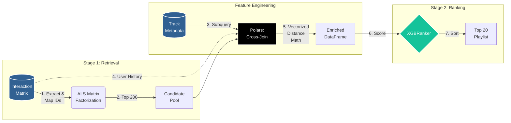

# Two-Stage Music Recommendation Engine


Simulates Spotify's recommendation system by generating a "Discover Weekly"-style playlist: given a playlist, it hands back
twenty recommended tracks the user might enjoy. Trained on the Spotify Million Playlist Dataset, roughly 66 million listening interactions across 2 million tracks.

Instead of using a single model, this project splits the problem into a **Two-Stage Funnel**: a fast retrieval pass that narrows millions
of candidates down to a couple hundred, followed by a ranking pass that sorts those down to the
final twenty. **PostgreSQL** handles the heavy, out-of-core data transformations and **XGBoost (Learning-to-Rank)** handles the final sort.

## Dataset Overview

The pipeline works over two large tables from the start:

### 1. Interaction Matrix (`interaction_matrix`)
From the Spotify Million Playlist Dataset. Each row is a track that shows up in a given playlist, which stands in for a user's listening history.
* **Data Scale:** ~66,000,000 interaction rows

| Column Name   | Data Type | Description                                                  |
|:--------------|:----------|:-------------------------------------------------------------|
| `playlist_id` | `TEXT`    | Unique string identifier for the playlist             |
| `track_id`    | `TEXT`    | Unique Spotify string track URI          |

### 2. Unified Track Metadata (`track_metadata`)
Contains the acoustic properties (danceability, tempo, energy, etc.) that the ranking stage uses to
score how well a candidate track fits a listener's taste.
* **Data Scale:** ~2,000,000 unique tracks

| Column Name      | Data Type  | Constraints   | Description                                                    |
|:-----------------|:-----------|:--------------|:---------------------------------------------------------------|
| `track_id`       | `TEXT`     | `PRIMARY KEY` | Unique Spotify string track URI                   |
| `artist_name`    | `TEXT`     |               | Name of the primary performing artist                          |
| `track_name`     | `TEXT`     |               | Name of the track song title                                   |
| `danceability`   | `REAL`     |               | Measure of how suitable the track is for dancing (0.0 to 1.0)  |
| `tempo`          | `REAL`     |               | Estimated overall tempo of the track in beats per minute (BPM) |
| `energy`         | `REAL`     |               | Perceptual measure of intensity and activity (0.0 to 1.0)      |
| `acousticness`   | `REAL`     |               | Confidence the track is acoustic (0.0 to 1.0)                  |
| `loudness`       | `REAL`     |               | Overall loudness of a track in decibels (dB)                   |
| `valence`        | `REAL`     |               | Measure of musical positiveness conveyed (0.0 to 1.0)          |


### 3. The Mapping Layer (`interaction_matrix_mapped`)
This table, built with a server-side `DENSE_RANK()` window function, remaps Spotify's long URIs to contiguous 32-bit integers
(`playlist_int_id` and `track_int_id`) so the `implicit` library can hold the sparse interaction grid in memory
efficiently.

## System Architecture

Generating the 20-song playlist happens in two passes:

1. **Stage 1: Candidate Generation**
   An **Alternating Least Squares (ALS)** matrix factorization model (via the `implicit`
   library) trains on the sparse user-item grid (`interaction_matrix_mapped`) and, given a playlist, narrows the full ~2.2 million-song
   catalog down to a personalized shortlist of **200 candidate tracks**.

2. **Stage 2: Scoring & Ranking**
   Each of those 200 candidates gets its audio features attached, plus a vectorized measure of how closely it
   matches the listener's taste profile. An **XGBRanker** model then scores and sorts them, trained to optimize
   **NDCG (Normalized Discounted Cumulative Gain)**, a metric that specifically penalizes errors near the top of the ranking, since that's what a listener would see first. The result is the final Top 20.

```mermaid
graph LR
    subgraph "Stage 1: Retrieval"
        A[(Interaction<br>Matrix)] -->|1. Extract &<br>Map IDs| B(ALS Matrix<br>Factorization)
        B -->|2. Top 200| C[Candidate<br>Pool]
    end

    subgraph "Feature Engineering"
        D[(Track<br>Metadata)] -->|3. Subquery| E[Polars:<br>Cross-Join]
        A -.->|4. User History| E
        C --> E
        E -->|5. Vectorized<br>Distance<br>Math| F[Enriched<br>DataFrame]
    end

    subgraph "Stage 2: Ranking"
        F -->|6. Score| G{XGBRanker}
        G -->|7. Sort| H[Top 20<br>Playlist]
    end
    
    style A fill:#316192,stroke:#fff,stroke-width:2px,color:#fff
    style D fill:#316192,stroke:#fff,stroke-width:2px,color:#fff
    style G fill:#15C39A,stroke:#fff,stroke-width:2px,color:#fff
    style E fill:#000000,stroke:#fff,stroke-width:2px,color:#fff
```


## Engineering Decisions

* **Out-of-Core Memory Management:** Aggregations like `DENSE_RANK()`, `AVG()`, and `COUNT()` run inside
PostgreSQL rather than in Python, which keeps the Python process's memory footprint under 2GB even though the
underlying tables are far larger than that.
* **Idempotent Infrastructure:** Nothing depends on manual SQL console work. The ingestion script
(`src/ingestion.py`) tears down and rebuilds the database from scratch, so the whole pipeline is reproducible end-to-end.
* **Shift-Left Data Quality:** Rather than attaching audio features with real-time API calls, acoustic features were merged in all at once via a one-time ETL migration from an open-source
database.


## Evaluation

The pipeline was evaluated using both offline metrics and a live A/B test simulation. Evaluation sits in its own [`eval/`](eval/) directory. Both use a held-out split of each
playlist's tracks as a proxy for "would the listener have liked this recommendation":

* **[`eval/evaluate.py`](eval/evaluate.py)** runs an offline comparison of three systems: the full engine (ALS +
XGBRanker), an ALS-only ablation (retrieval with no reranking), and a popularity baseline (just the most
globally-interacted-with tracks). Reports Recall@K and NDCG@K for each arm, with a paired t-test against the baselines.

  ```bash
  python eval/evaluate.py --n-playlists 2000 --holdout-frac 0.2 --k 20
  ```

* **[`eval/ab_test_sim.py`](eval/ab_test_sim.py)** simulates a live experiment seeking to find out whether the full engine (ALS + XGBRanker) beats a cheaper ALS-only ablation.
In line with the limitations of a real-life A/B test, the script assigns each playlist to
only one of the two arms and compares them with
independent-sample tests (Welch's t-test for the continuous metrics, a two-proportion z-test for the binary hit
rate). It runs a small pilot first (scored under both arms) to estimate each arm's rate and variance, prints a
power analysis (per-arm sample size required to reach the desired minimum detectable effect), and sizes the full run to based on the required per-arm n. 
  ```bash
  python eval/ab_test_sim.py --n-playlists 3000 --k 20 --pilot-n 200
  ```

## Results

### Offline Evaluation

| Metric      | Full Engine | ALS-only | Popularity |
|:------------|:-----------:|:--------:|:----------:|
| Recall@K    | `0.0164`   | `0.0184`| `0.0107`  |
| NDCG@K      | `0.0146`   | `0.0148`| `0.0123`  |

* **Full Engine vs Popularity:** `18.70`% lift in NDCG over the popularity baseline
  (t=`1.763`, p=`0.0780`).
* **Full Engine vs ALS-only:** `-1.35`% lift in NDCG over the ALS-only ablation
  (t=`-0.108`, p=`0.9143`). This result is not statistically significant at `alpha`=0.05, so we cannot say that the full engine performs differently from the ALS-only ablation.

### A/B Test Simulation

| Metric        | Treatment | ALS-only | Lift        | Test                          |
|:--------------|:---------:|:--------:|:-----------:|:-------------------------------|
| NDCG@K        | `0.0124` | `0.0165`| `-0.0040`   | Welch's t: t=`-2.943`, p=`0.0033` |
| Recall@K      | `0.0138` | `0.0196`| `-0.0059`   | Welch's t: t=`-3.576`, p=`0.0004` |
| Hit rate      | `0.1449` | `0.1479`| `-0.0029`   | z-test: z=`-0.287`, p=`0.7738`    |

The full engine underperforms compared to the ALS-only ablation, meaning it does not earn its extra complexity. In a business scenario, I would not recommend pushing the new recommendation engine.
  

## Running the Pipeline

### 1. Download the Datasets
Create a `data/` directory in your project root and download the following prerequisites:
* **Interaction Matrix:** Download the [Spotify Million Playlist Dataset on Kaggle](https://www.kaggle.com/datasets/himanshuwagh/spotify-million?resource=download) and place the raw slices in `data/raw/spotify_mpd/`.
* **Unified Audio Features:** Download the [2 Million Songs Audio Features Dataset](https://www.kaggle.com/datasets/krishsharma0413/2-million-songs-from-mpd-with-audio-features) and save it as `data/raw/extracted.sqlite`.

### 2. Environment Setup
Make sure you have a PostgreSQL server running locally (port 5432), then install the drivers and modeling libraries:
```bash
pip install polars psycopg connectorx implicit xgboost scipy numpy
```

### 3. Build the Database

Run the ingestion script. It drops any old tables, rebuilds `track_metadata` and `interaction_matrix` from the
raw files, and generates the integer ID mappings the sparse math needs:

```bash
python src/ingestion.py
```

### 4. Train the Engines

Train the Stage 1 retriever and the Stage 2 ranker. Each script builds its own matrices, trains, and writes its
learned weights to disk (`als_model.npz` and `xgb_ranker.json`):

```bash
python src/train_als.py
python src/train_ranking.py
```

### 5. Run Inference (Discover Weekly)

Generate a playlist. This mocks a request for a given user, loads the trained artifacts into memory, runs them
through the full retrieval-then-ranking funnel, and prints the resulting Top 20 tracks:

Pass either an existing playlist (`--playlist-id`) or a set of seed tracks (`--track-ids`, the cold-start path):

```bash
python src/recommend.py --playlist-id 42
```

### 6. Evaluate the Engine

Once you have trained models, check whether they're actually earning their complexity — see the
[Evaluation](#evaluation) section above for what each script measures:

```bash
python eval/evaluate.py --n-playlists 2000 --holdout-frac 0.2 --k 20
python eval/ab_test_sim.py --n-playlists 3000 --k 20 --pilot-n 200
```

